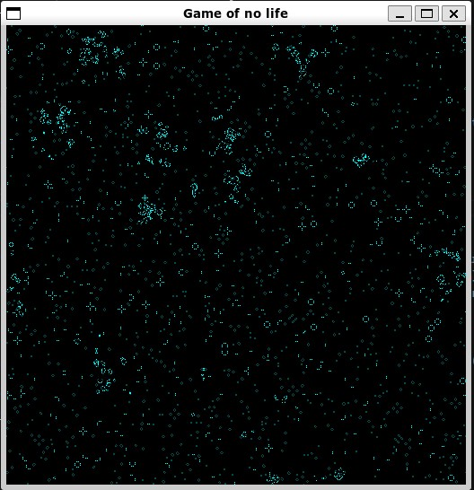

# Conway's game of life in Opengl

This project aims to compute Conway's game of life entirely through opengl shaders
It is a toy project written to better understand OpenGl, so it may not be as efficient as possible

## How does it works?

1. Creation of a FrameBufferObject (FBO) containing two attachments: COLOR_ATTACHMENT0, COLOR_ATTACHMENT1 that are linked to two textures
2. Filling COLOR_ATTACHMENT0 related texture with random data to init the grid
3. While in the main loop, seletcting COLOR_ATTACHMENT1 as the destination for the next render
4. Using a first shader program:

- We create 2 triangles with an identity vertex shader
- We render the next iteration of Conway's game of Life thanks to the fragment shader.
- This shader will use COLOR_ATTACHMENT0 as a uniform texture to know the current grid step, then it can use current texture/pixel position provided by the vertex shader and output the final pixel color

5. We now have the next iteration of Conway's game of ligne in COLOR_ATTACHMENT1 texture
6. We switch back to default ouput, and we use a new shader program (dispShaderProgram) to simply render COLOR_ATTACHMENT0 to the screen
7. Finally, we swap textures (only swapping pointers to avoid heavy copy). During the next iteration, we will use COLOR_ATTACHMENT0 for first output and use COLOR_ATTACHMENT_1 as last-iteration grid

Note:
We only use the R color canal for buffers because we only want to have a binary state (alive, dead)

- The window is built with [GLFW](https://www.glfw.org)
- [glad](https://glad.dav1d.de/) handles OpenGl function pointer loading

## Requirements

1. download glfw from here https://www.glfw.org/download.html
2. `cd glfw-x.y.z`
3. `cmake -S . -B build`

retrieve the `libgkfw3.a` from `build/src` and copy it to the extern folder

## How to run it?

in the source folder, type `make run`

# Commands

- directional arrows: move the viewport
- left shift: zoom in
- left ctrl: zoom out

# Potential improvements

- The project coul be nicer by using a full color map instead of just using a certain percent of green according to the number of iterations
- FPS could be displayed in real time on the screen instead of relying on stdout.

# Sources

Heavily inspired by:

- [mandelbrot implementation](https://physicspython.wordpress.com/2020/02/16/visualizing-the-mandelbrot-set-using-opengl-part-1/)
- [for opengl setup](https://learnopengl.com/)
