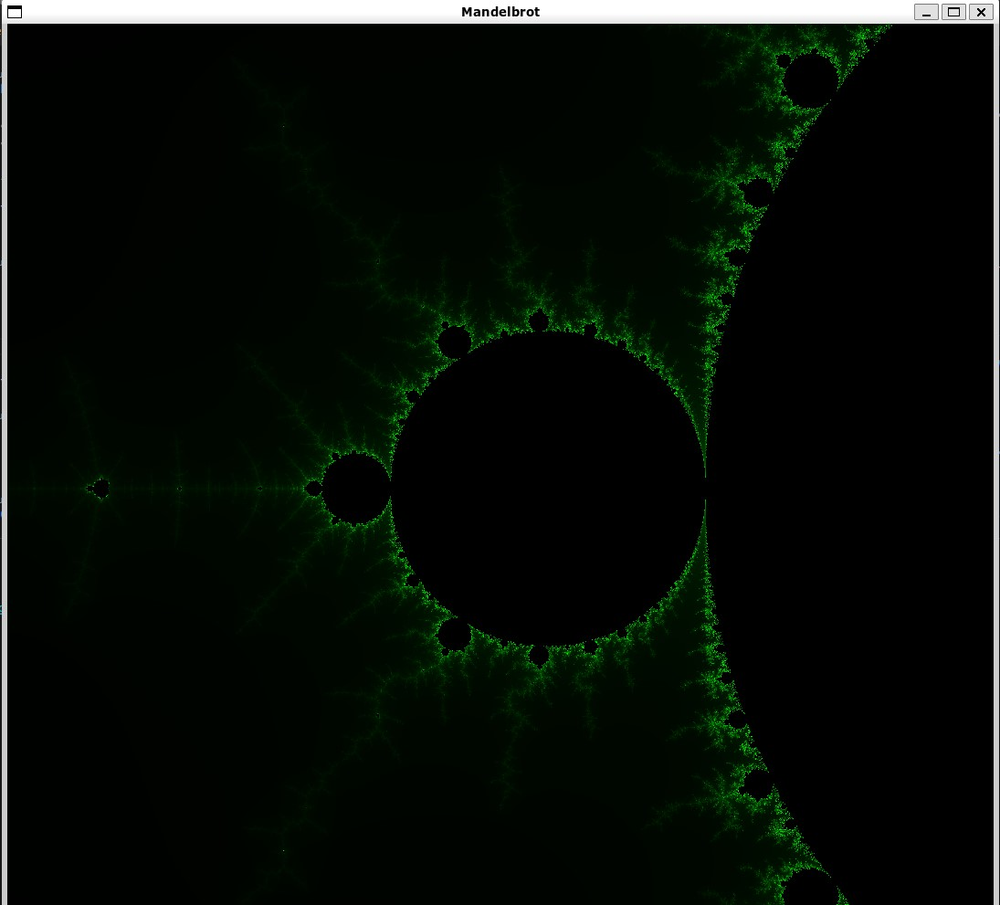

# Mandelbrot explorer in Opengl

This is a toy project written to better understand OpenGl.

- The window is built with [GLFW](https://www.glfw.org)
- [glad](https://glad.dav1d.de/) handles OpenGl function pointer loading

## Requirements

1. download glfw from here https://www.glfw.org/download.html
2. `cd glfw-x.y.z`
3. `cmake -S . -B build`

retrieve the `libgkfw3.a` from `build/src` and copy it to the extern folder

## How to run it?

in the source folder, type `make run`

# Commands

- directional arrows: move the viewport
- left shift: zoom in
- left ctrl: zoom out

# Potential improvements

- The project coul be nicer by using a full color map instead of just using a certain percent of green according to the number of iterations
- FPS could be displayed in real time on the screen instead of relying on stdout.

# Sources

Heavily inspired by:

- [mandelbrot implementation](https://physicspython.wordpress.com/2020/02/16/visualizing-the-mandelbrot-set-using-opengl-part-1/)
- [for opengl setup](https://learnopengl.com/)
